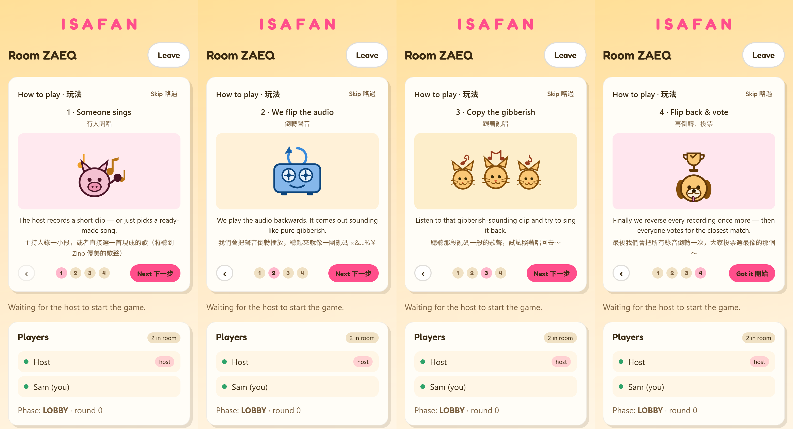

# isafan — reverse-audio party game



A Jackbox-style party game built around **reversed audio**: one person sings and
records, everyone hears it played backwards and tries to mimic *that*, then each
attempt is reversed again so the group can judge who landed closest.

Architecture, options, and the full roadmap live in the plan doc:
`~/.claude/plans/i-want-to-create-vectorized-parnas.md`.

## Status — Phase 7 (online hosting)

Done:

- **Phase 1** — FastAPI server (`/api/health`, `/api/games/{code}`, `/ws`),
  `Storage` abstraction (local disk), in-memory game registry with readable
  4-char codes, create/join/live lobby/rejoin, Svelte + Vite SPA.
- **Phase 2** — host records the song → `POST /api/games/{code}/original` →
  server reverses + transcodes to a canonical 16 kHz mono WAV with ffmpeg →
  players fetch and play the reversed clip. ffmpeg ships via `imageio-ffmpeg`.
- **Phase 3** — `/solo` pass-the-phone flow, no WebSocket: name players →
  record → hear it backwards → each player mimics in turn
  (`POST /api/games/{code}/attempts`) → reveal forwards → show-of-hands vote.
- **Phase 4** — the same loop across the host screen + phones. Host WS verbs
  `start_audience_recording` / `start_reveal` / `next_round` drive the phases;
  players submit takes to `/attempts` (one per player, re-record replaces it)
  and cast `vote` messages (one each, not their own take). Host screen shows a
  submission checklist then a live vote tally; player screens show a recorder
  then a vote list. Late joins are blocked once the round starts.
- **Phase 5** — retention & safety hardening. A background sweep
  (`server/retention.py`, `ISAFAN_PURGE_INTERVAL`) deletes each game's stored
  folder once it's older than `ISAFAN_GAME_TTL`, on startup and on the
  interval. Per-IP token-bucket rate limit on game creation
  (`ISAFAN_CREATE_RATE` / `_WINDOW`). Upload size/duration/content-type caps
  audited on both upload paths incl. the iOS video-recorder fallback. Frontend:
  a join-time privacy notice, an unmissable "mic is live" banner, a screen Wake
  Lock during a take, and a reconnect resync that clears stale local UI state.
- **Phase 6a** — server-rendered `/admin` portal (`server/admin/`), off until
  `ISAFAN_ADMIN_USER` + `ISAFAN_ADMIN_PASSWORD_HASH` are set
  (`python -m server.admin.hashpw` mints the scrypt hash). Signed-cookie
  session with per-IP login throttling; a status page (uptime, active games,
  disk + clip usage, next purge); a recordings browser with inline playback of
  every stored take; and CSRF-guarded "delete now" for a single clip or a whole
  game. All storage access goes through the `Storage` interface.
- **Phase 6b** — `/admin/songs`: a preloaded reference-song library
  (`server/songs.py`, stored under `assets/songs/`). Upload to add, enable /
  disable, rename, delete, inline playback of the reversed / forward / source
  clips, and a per-song relay line-boundary editor. Ingest is shared with the
  in-game upload path (`server/ingest.py`). In gameplay, `GET /api/songs` +
  `POST /api/games/<code>/original/library` let the host (or a solo player)
  **pick a library song** instead of recording the original — `SongPicker`
  sits under the recorder on those screens.

- **Phase 7** — deployable: a multi-stage `Dockerfile` (Node builds the SPA,
  Python runtime bundles ffmpeg via `imageio-ffmpeg`) + `docker-compose.yml`
  with a persistent `/data` volume, and an `S3Storage` backend
  (`ISAFAN_STORAGE=s3`, works with AWS S3 / Cloudflare R2 / MinIO) so clips can
  live in object storage instead of the volume. Runs as a **single instance**
  (see "Deploy" — the WebSocket hub and game registry are in-process); TLS is
  terminated by the platform or a proxy in front.

Not yet: `relay` mode (split a library song into per-player lines — design
settled in `backlog.md`, not built).

> On a plain-http LAN page the browser blocks in-page recording, so the record
> control falls back to the phone's own voice recorder via a file input (see
> "Recording over plain HTTP"). The in-page `MediaRecorder` path still wants a
> check on a real Android phone and a real iPhone over HTTPS (formats differ:
> webm/opus vs mp4/aac; the server transcodes both). Flows were verified
> in-browser with a synthetic mic and headless end to end.

## Prerequisites

- Python 3.10+ (a venv built from the Anaconda interpreter is fine)
- Node 18+ and npm

## Setup

```bash
# backend
python -m venv .venv
.venv\Scripts\python -m pip install -r server/requirements.txt   # Windows
# .venv/bin/pip install -r server/requirements.txt               # macOS/Linux

# frontend
npm --prefix web install
```

## Run — development (two processes, hot reload)

```bash
# terminal 1: API + WebSocket on :8000
.venv\Scripts\python -m uvicorn server.main:app --reload

# terminal 2: UI on :5173 (proxies /api and /ws to :8000)
npm --prefix web run dev
```

Open <http://localhost:5173>. Host a game in one tab, join from another with the
code.

## Run — single process (what phones will hit)

```bash
npm --prefix web run build            # emits web/dist
.venv\Scripts\python -m server        # serves API, WS, and the built SPA on :8000
```

Open <http://localhost:8000>.

## Deploy (Docker)

```bash
docker compose up --build             # builds the SPA + image, runs on :8000
```

Edit `docker-compose.yml` first: set `ISAFAN_PUBLIC_URL` to the address players
will actually reach, and (to enable the `/admin` portal) `ISAFAN_ADMIN_USER` +
`ISAFAN_ADMIN_PASSWORD_HASH` (`python -m server.admin.hashpw` prints the line).
The image bundles ffmpeg, so there is nothing else to install.

- **TLS** is not handled by the app. Put it behind your platform's load
  balancer or a reverse proxy (Caddy, Traefik, nginx) that terminates HTTPS and
  forwards to `:8000` — including the `/ws` WebSocket upgrade.
- **Storage.** By default clips + `game.json` + the song library go in the
  `/data` volume. To keep them in object storage instead, set
  `ISAFAN_STORAGE=s3` and the `ISAFAN_S3_*` vars (AWS S3, Cloudflare R2, or
  MinIO — omit the access-key vars to use an attached IAM role). The retention
  sweep and the admin portal work the same either way.
- **Single instance only.** The live-gameplay state — the WebSocket hub's
  connections and the in-memory game registry — is per-process, so run exactly
  one replica (`scale: 1`, no rolling deploy overlap). A restart is safe:
  in-progress rooms drop but all stored audio/metadata survives via `Storage`.
  Horizontal scale would need a shared pub/sub + registry (e.g. Redis) and is
  deliberately out of scope until the load calls for it — one small container
  comfortably handles a party.

## Play from a phone (same Wi-Fi)

Just run the server and open <http://localhost:8000/host> on this machine. When
`ISAFAN_PUBLIC_URL` is unset the server auto-detects this machine's LAN IP and
builds the QR / join link from it (`http://<lan-ip>:8000/...`); the address it
chose is printed on startup. Scan it from a phone on the same Wi-Fi.

If the phone can't reach that address, the host screen shows a "Phone can't
reach it? Try:" row under the QR — tap another detected address (e.g. when a VPN
adapter was picked first) and the QR updates. Or pin one yourself:
`ISAFAN_PUBLIC_URL=http://192.168.1.20:8000` in a `.env` file (also how you'd
point it at a tunnel URL).

Notes: Windows Firewall may prompt to allow port 8000 (allow it for Private
networks). A VPN on this machine can block phone↔PC LAN traffic.

### Recording over plain HTTP

`getUserMedia` (in-page recording) only works in a secure context — HTTPS or
`localhost`. On a phone hitting `http://<lan-ip>:8000` it's blocked, so the
record control automatically falls back to a **file input**: the phone opens its
own voice recorder, and the clip is uploaded through the same pipeline. Slightly
clunkier (no in-page REC timer), but zero setup and works on iOS and Android.

For the polished in-page recorder without a tunnel, serve HTTPS with a
locally-trusted cert:

```bash
mkcert -install                         # once, trusts a local CA on this machine
mkcert 192.168.1.20 localhost 127.0.0.1 # -> 192.168.1.20+2.pem  + -key.pem
```

Then set `ISAFAN_SSL_CERT` / `ISAFAN_SSL_KEY` (and
`ISAFAN_PUBLIC_URL=https://192.168.1.20:8000`) and run `python -m server`. On
each phone, install the mkcert root CA once — `mkcert -CAROOT` shows where
`rootCA.pem` lives; on iOS install the profile then enable it under Settings →
General → About → Certificate Trust Settings, on Android use "Install a
certificate → CA certificate". After that the phone trusts `https://<lan-ip>`
and records in-page.

## Tests

```bash
.venv\Scripts\python -m pip install -r server/requirements-dev.txt
.venv\Scripts\python -m pytest          # server: game model, storage, audio, ws + http endpoints
npm --prefix web run check              # web: svelte-check
```

The server tests synthesize tiny audio clips with the bundled ffmpeg and drive
the API/WebSocket through Starlette's `TestClient`; they use an isolated temp
data dir (no `./data` writes).

## Configuration

All optional — see `.env.example`. Read at startup from the environment or a
local `.env` file. Notable: `ISAFAN_PUBLIC_URL` (join-link / QR base address),
`ISAFAN_PORT`, `ISAFAN_MAX_PLAYERS`, `ISAFAN_DATA_DIR`, `ISAFAN_STORAGE`
(`local` | `s3`), and the `ISAFAN_ADMIN_*` / `ISAFAN_S3_*` groups.

## Layout

```
server/   FastAPI app — config, storage (local + s3), game model, ws hub, audio
server/admin/   server-rendered /admin portal (auth, status, recordings, songs)
server/tests/   pytest suite
web/      Svelte + Vite SPA — routes/, lib/ (socket client, router, components)
data/     runtime only (gitignored): per-game folders + game.json, song library
Dockerfile, docker-compose.yml   single-instance deploy (see "Deploy")
```

## Credits

Inspiration: C Wong
